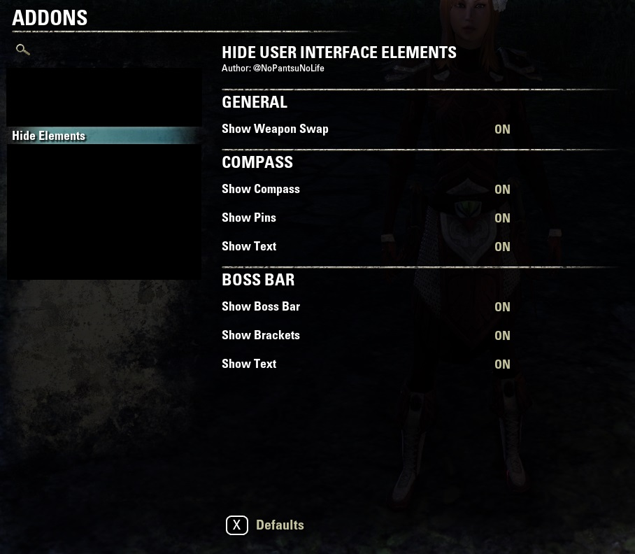

# Hide Elements

Change the visibility of different elements in the UI with the addon settings.

Addon for Elder Scrolls Online
* http://www.esoui.com/downloads/info1573-HideElements.html
* https://teso.curseforge.com/projects/hide-elements
* http://www.nexusmods.com/elderscrollsonline/mods/81

